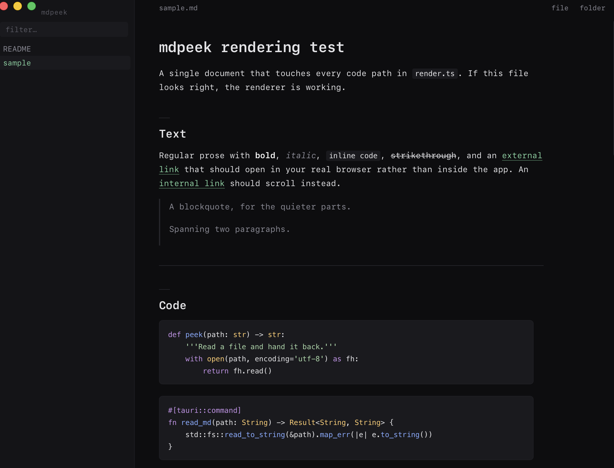
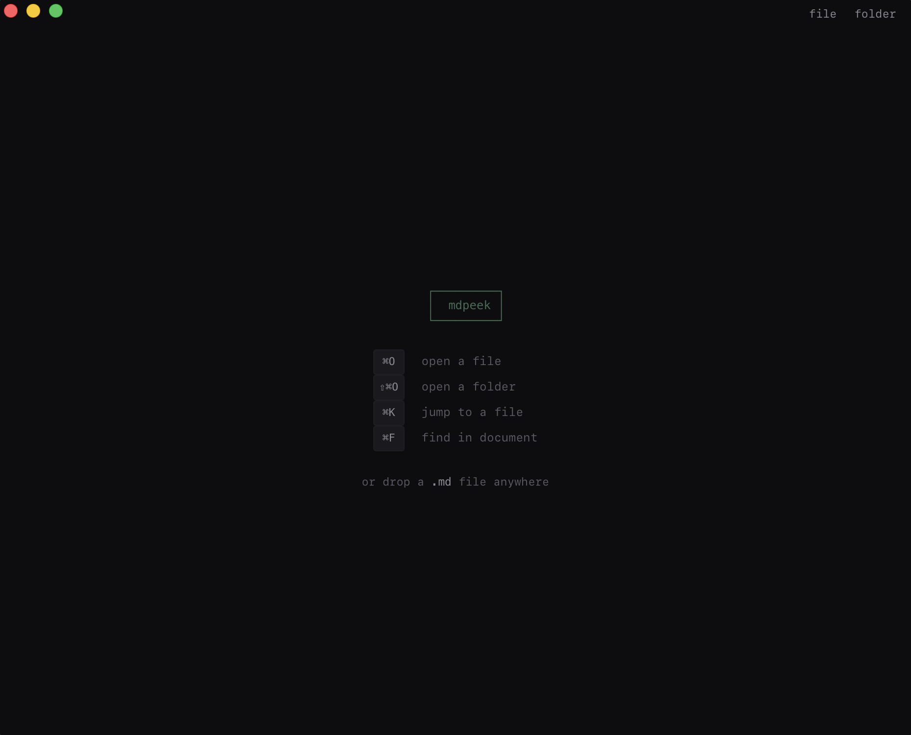

# mdpeek

A simple, lightweight Markdown reader.

Open a file, read it, move on. No sync, plugins, or vaults.

Built with Tauri, mdpeek uses the WebKit already on your Mac — no bundled Chromium or Electron runtime.



### Prerequisites

- [Rust](https://rustup.rs) 1.77.2 or newer
- Node.js 22.22.2+ (22.x), 24.15+ (24.x), or 26+
- Xcode Command Line Tools

```sh
curl --proto '=https' --tlsv1.2 -sSf https://sh.rustup.rs | sh
xcode-select --install
```

### Run

```sh
npm install
npm run tauri dev
```

Build the macOS app for your own Mac:

```sh
npm run tauri build
open src-tauri/target/release/bundle/macos/
```

Build a universal app that runs on both Apple Silicon and Intel:

```sh
rustup target add aarch64-apple-darwin x86_64-apple-darwin
npm run tauri build -- --target universal-apple-darwin
open src-tauri/target/universal-apple-darwin/release/bundle/macos/
```

To use `.md` file associations, build the app and move `mdpeek.app` to `/Applications`.

Prebuilt `.dmg` releases are universal: they run on Apple Silicon and Intel Macs
on macOS 10.15 or newer.

Because the app isn’t notarized, macOS may block downloaded builds. Clear the quarantine flag first:

```sh
xattr -d com.apple.quarantine /Applications/mdpeek.app
```

### Shortcuts

| Key | Action |
| --- | --- |
| `⌘O` / `⇧⌘O` | Open file / folder |
| `⌘K` | Jump to a file (`>` searches contents) |
| `⌘F` | Find in document |
| `⌘B` | Toggle sidebar |
| `⌘=` `⌘-` `⌘0` | Text size |
| `j` `k` `space` `g` `G` | Scroll |



You can also drop a `.md` file or folder onto the window, or open one from the shell:

```sh
mdpeek notes.md
```

### Small by design

A plain Markdown document loads about **151KB of JavaScript**.

KaTeX and Mermaid are loaded only when needed. Syntax highlighting includes only 13 languages, and unused KaTeX font formats are removed at build time.

The frontend bundle is about **4MB**, with Mermaid accounting for most of it.

### Safe by default

Filesystem access is handled by three read-only Rust commands, guarded by file extensions and an 8MB limit.

Rendered Markdown is sanitized with DOMPurify before reaching the DOM. Mermaid runs with `securityLevel: 'strict'`.

### Coming in v2

**Editing.**

mdpeek will stay a lightweight Markdown viewer, with the option to make quick edits to the file you're reading — without turning into a full-blown editor.

### Structure

```text
src/
  main.ts       app wiring and keyboard controls
  render.ts     Markdown rendering
  sidebar.ts    file navigation
  style.css     styles

src-tauri/src/
  lib.rs        app setup
  files.rs      read-only filesystem access
  watch.rs      live reload
```

That's it. mdpeek reads Markdown.

### License

MIT — see [LICENSE](LICENSE).

### Tests and CI

```sh
npm ci
npm test
npx playwright install webkit
npm run test:ui
npm run build
cargo test --locked --manifest-path src-tauri/Cargo.toml
```

`npm run test:watch` reruns frontend tests as you edit. Use a supported Node
version above; Node 20 cannot run the installed test dependencies.

| Coverage | Why it matters |
| --- | --- |
| Markdown, frontmatter, headings, code, math, and diagrams | These are the reader's core output; parser and renderer upgrades can change it. |
| HTML sanitization and link routing | Documents are untrusted. Strip executable content and reveal local non-Markdown files in Finder. |
| Rust file validation, size boundaries, traversal limits, symlinks, and search | Keep reads constrained and folder navigation bounded; verify search limits and Unicode snippets. |
| Sidebar, cancellation, read errors, find, and live reload events | Protect everyday reading flows, focus behavior, and the current document when operations fail. |
| WebKit layout, resizing, scrolling, and lazy rendering | DOM tests cannot validate CSS geometry or real browser rendering. |
| TypeScript production build and Tauri compilation | Catch type errors, bundling failures, and native integration build failures. |

GitHub Actions runs these checks on macOS for every push and pull request,
including `npm run tauri build -- --debug --no-bundle`. Failed browser runs
upload screenshots, traces, and an HTML report for diagnosis.

Browser and app tests replace native IPC. Before a release, manually check the
desktop app with `npm run tauri dev`: native file/folder dialogs, drag and drop,
Finder file associations, local images, and live reload after repeated atomic
editor saves. The automated reload test exercises event handling, not the
operating system's filesystem watcher or signed distribution packaging.
