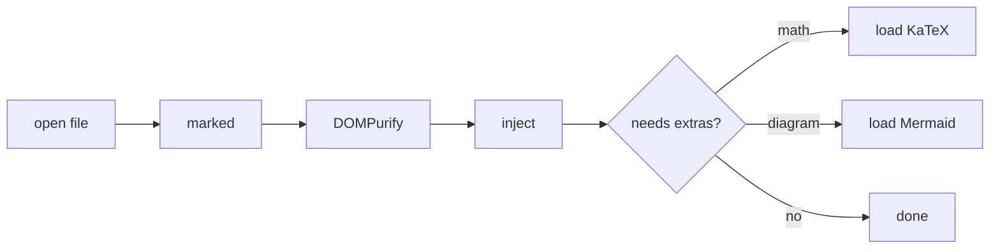

# mdpeek rendering test

A single document that touches every code path in `render.ts`. If this file looks
right, the renderer is working.

## Text

Regular prose with **bold**, *italic*, `inline code`, ~~strikethrough~~, and an
[external link](https://tauri.app) that should open in your real browser rather
than inside the app. An [internal link](#code) should scroll instead.

> A blockquote, for the quieter parts.
>
> Spanning two paragraphs.
---

## Code

```python
def peek(path: str) -> str:
    '''Read a file and hand it back.'''
    with open(path, encoding='utf-8') as fh:
        return fh.read()
```

```rust
#[tauri::command]
fn read_md(path: String) -> Result<String, String> {
    std::fs::read_to_string(&path).map_err(|e| e.to_string())
}
```

```
a fence with no language — should render plain, not highlighted
```

## Tables

| Chunk    | Built size | Parsed              |
| -------- | ---------- | ------------------- |
| index    | 151KB      | always              |
| katex    | 289KB      | only with math      |
| mermaid  | 3.4MB      | only with a diagram |

## Task list

- [x] render markdown
- [x] sanitize before injecting
- [ ] decide whether this needs anything else

## Math

Inline: the measure is $76$ characters, and $E = mc^2$ still holds.

Not math: this costs $5 and that costs $10, so neither `$` should be eaten.

Display:

$$
\int_{0}^{1} x^2 \, dx = \frac{1}{3}
$$

## Diagram



## Sanitizer check

The next line contains an injection attempt. You should see the text, and nothing
should execute:

<span onclick="alert('xss')">sanitized text</span>

<script>alert('xss')</script>

## Nesting

1. First
2. Second
   - nested bullet
   - another, with `code`
3. Third

Done.
